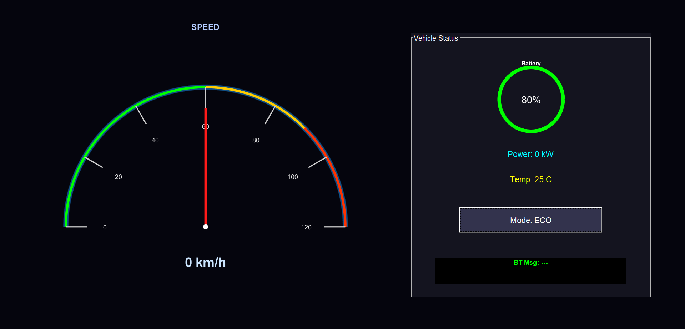

# EV Dashboard HMI (MATLAB)

## Overview
This project implements a real-time Electric Vehicle (EV) dashboard using MATLAB with Bluetooth-based communication.

## Demo appearance 

## System Architecture
The dashboard simulates an EV HMI system with real-time visualization and Bluetooth-based communication between the vehicle and external device.
## Features
- Semi-circular speedometer with dynamic needle
- Battery monitoring system with color indication
- Power and temperature display
- Bluetooth communication (HC-05 / ESP32)
- Drive mode selection (ECO / NORMAL / SPORT)

## Technologies Used
- MATLAB (UI + Visualization)
- Serial Communication (Bluetooth)

## How to Run
1. Open MATLAB
2. Run `main.m`
3. Ensure Bluetooth device is connected
4. Update COM port if required

## Future Scope
- Simulink integration
- AI-based fault detection
- Mobile app interface

## Author
Aravind Kumar N
